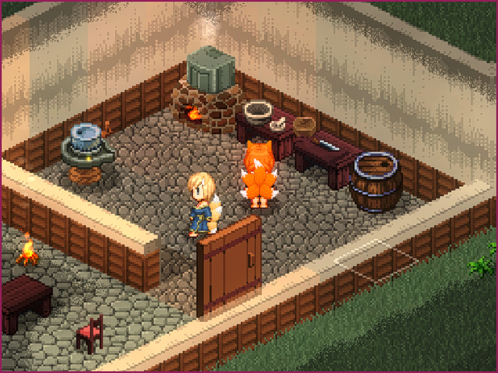
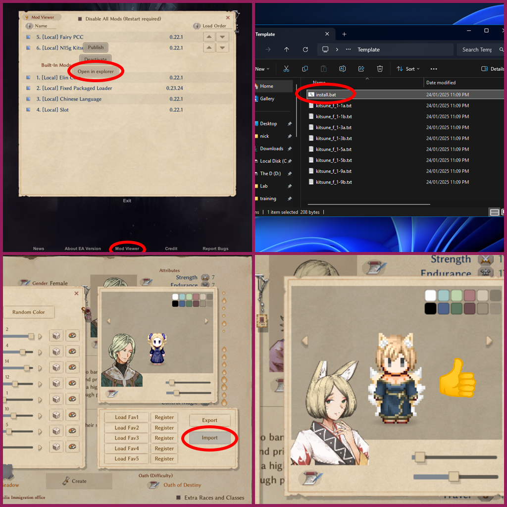

# Elin Kitsune PCC


[](https://steamcommunity.com/sharedfiles/filedetails/?id=TODO)


### A Kitsune PCC mod for [Elin](https://store.steampowered.com/app/2135150/Elin/)

[Touch fluffy tail]


The Nefu are a fox-like race with tails that increase in number as they age... so where are all the tails??

This mod adds a bunch of new tail options that allow you to drown your characters in a fluffy heaven.

* 1, 3, 5 and 9-tail variants in two color tones to match Mifu and Nefu fur colors.
* A set of fluffier and pointier ears.
* Body variants with no human ears.



## Character Creation

Since the back slot is not available during initial character creation you will need to either find a mirror after
character creation to change your appearance, or use an import template that has the back slot set.

Included in the mod directory is a set of import templates with attachments and outfits pre-applied, and a .bat file
that will copy those files to the default import directory for convenience.



You can find the mod folder by selecting the `Mod Viewer` on the title screen, or from the main menu during the game.
Click the mod name and then `Open in Explorer`.
Use the files from the `Template` folder with the `Import` function in the character editor.

# Licence

The license for all content unless otherwise labelled is the [unlicense](LICENSE).

You are free to copy and use any of the mod content however you want, including in other mods or games.

Attribution is **not** required, but is always appreciated.

# Development

## Requirements

* **[Aseprite](https://www.aseprite.org/)** - For PCC sprites in `*.ase` format.
* **[Python](https://wiki.python.org/moin/BeginnersGuide/Download)** - Build scripts and various tooling.
* **[Poetry](https://python-poetry.org/docs/#installation)** - Python dependency manager.

## PCC Sprites

PCC sprite source files are **[Aseprite](https://www.aseprite.org/)** `.ase` files.

A set of development tools for Aseprite as well as instructions for setting up PCC sprite files can be found at
the [asprite-elin-devtools](https://github.com/n15g/aseprite-elin-devtools) project.

# Build

* ```poetry run invoke build``` - Build into the `build` folder.
* ```poetry run invoke dist``` - Create zip bundle in the `dist` folder.
* ```poetry run invoke install --path=C:\Your\Elin\Package\Folder``` - Build and install the package into your Elin
  `Package` folder.
